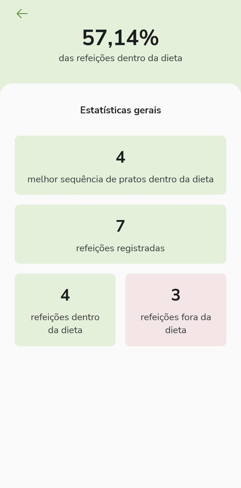
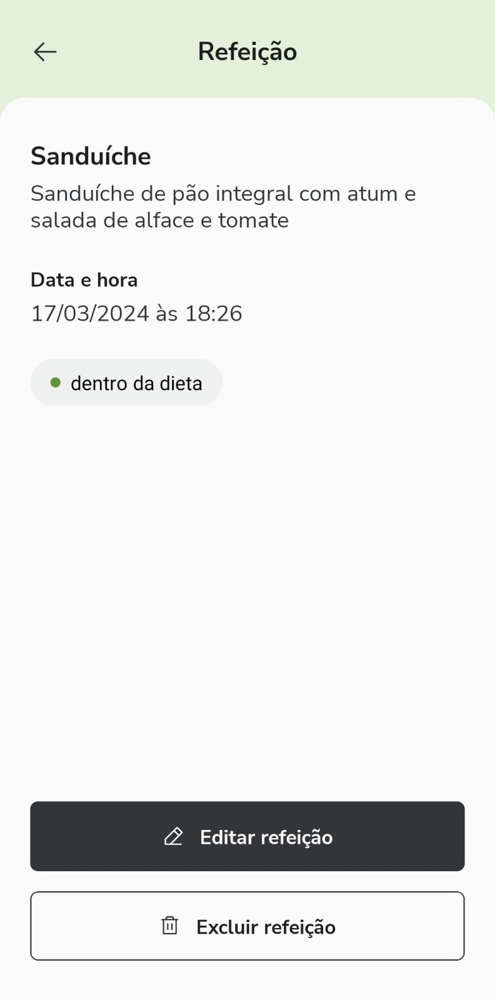
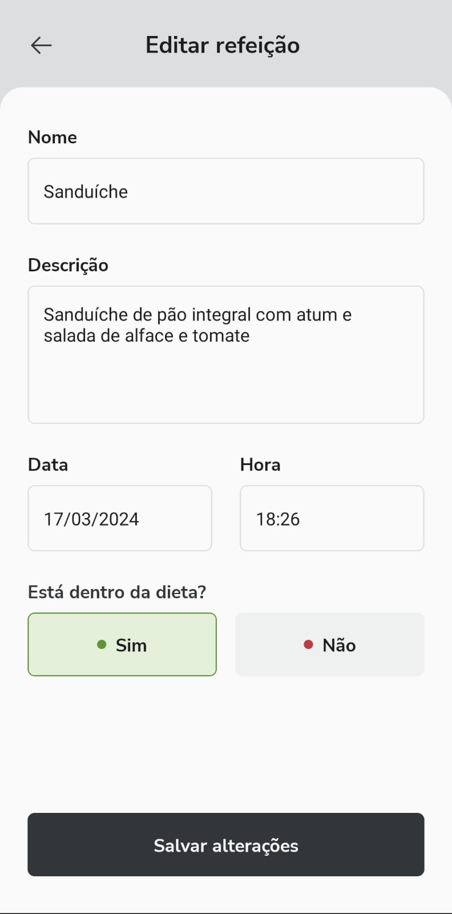

<h1 align="center">Daily Diet</h1>

O app Daily Diet foi criado com o intuito de compreender mais sobre navegação, estilização e armazenamento local no React Native. Daily diet é um app onde a pessoa pode cadastrar refeições e ter um acompanhamento da sua alimentação.

 

# 🚀 Tecnologias

Projeto desenvolvido com as seguintes tecnologias:

- React Native
- TypeScript
- Styled Components
- React Navigation
- Async Storage
- Expo
- Git e Github
- Figma

 

# 💻 Principais issues

- Desenvolver estilização das telas
- Criar navegação entre telas com react navigation
- Criar, editar, remover refeições
- Configurar lógica de cores, e das caixas da tela de estatística
- Validar formulário

  

<h2>Versão Mobile:</h2>

### Tela de Home
Nessa tela, o usuário pode vericar todas as suas alimentações em seus devidos dias e ver se fazia parte da dieta ou não, além de poder acessar a tela de estatísticas para ver seu rendimento.

  

 

### Tela de Estatística
Nessa tela, o usuário terá apenas a visibilidade mais aprofundada de seu rendimento, tendo noção da quantidade de refeições na dieta e fora dela, além de ver sua melhor sequência.

  

 

### Tela de Detalhes de uma refeição
Nessa tela, o usuário verá mais sobre uma determinada refeição, como descrição e data.

  

 

### Tela de Formulário
Essa tela se aplica tanto ao de edição de refeição quanto a de nova refeição, a diferença é que a primeira terá dados escritos no campo, enquanto a segunda não. Dentro dela, o usuário pode cadastrar uma nova refeição.

  

